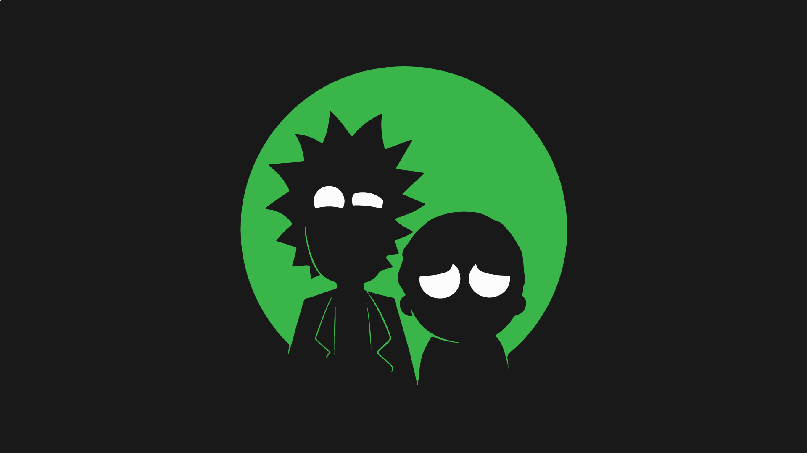

# JS Demo React App
JS Demo React app is a search app based on the television show "Rick and Morty" characters.
This app is created using Rick and Morty API: [Link to API](https://rickandmortyapi.com/)

Link to a **Github Page** - [link](https://amg28.github.io/js-demo-react-app/)

# Prerequisites
You must have the following installed:

* Node.js
* NPM (comes installed with Node)

# Installation
1. Install app dependencies by running:
`npm install`

2. Run app using command:
`npm start`

# Build and Deployment
1. To build an app you need to run:
`npm run build`

2. To deploy an app to Github pages you need to run:
`npm run deploy`

<!-- # Used Functions
| Syntax | Description |
| ----------- | ----------- |
| Header | Title |
| Paragraph | Text | -->

# Next steps checklist
- [X] Update app logo from PNG to SVG format
- [X] Add onkeydown event on a search input
- [ ]  Add CSS media quries for mobile view
- [ ] Add Character's detail view

# License
See the [LICENSE](/LICENSE.md) file for details.

1) "You have large amounts of application state that are needed in many places in the app"
What states are commonly used as global states in application?

2) "The Redux DevTools Extension shows a history of the changes to the state in your Redux store over time. This allows you to debug your applications effectively, including using powerful techniques like "time-travel debugging"."
Does it internally stores value of my store for each session I interact? And on next try it can show me the diff? Or I can check what was the states in previous session?

3)"Reducers must not do any asynchronous logic"
What means async logic in this context?
